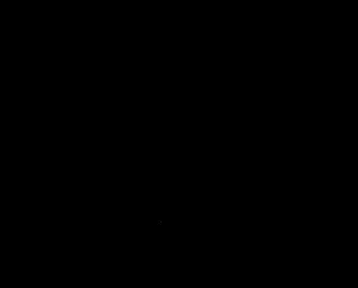

  <h1>SOLiD-A-LOAM</h1>
  
  
  
  
  
  
   
   

**[IEEE RA-L]** This repository is the official code for Narrowing your FOV with **SOLiD**: Spatially Organized and Lightweight Global Descriptor for FOV-constrained LiDAR Place Recognition.

  

    
    

## What is SOLiD-A-LOAM?
* A real-time LiDAR SLAM package that integrates A-LOAM and SOLiD.
  * A-LOAM for odometry (i.e., consecutive motion estimation)

## Main Contribution
* Hogyun Kim (hg.kim@inha.edu)
* Jiwon Choi (jiwon2@inha.edu)

## Special Thanks
Thank you [Giseop Kim](https://github.com/gisbi-kim/SC-A-LOAM) for providing the base code.
