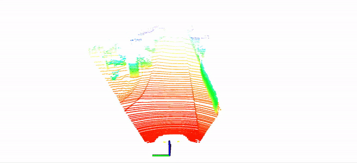
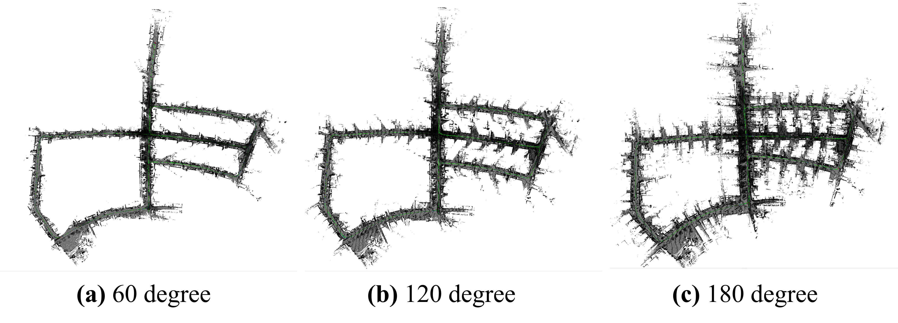

<div align="center">
  <h1>SOLiD-A-LOAM</h1>
  <a href="https://github.com/sparolab/solid/tree/master/"></a>
  <a href="https://github.com/sparolab/solid/tree/master/"></a>
  <a href="https://hub.docker.com/r/cokr6901/solid-a-loam/tags"></a>
  <a href="https://sites.google.com/view/lidar-solid"></a>
  <a href="https://ieeexplore.ieee.org/abstract/document/10629042"></a>
  <a href="https://arxiv.org/abs/2408.07330"></a>
  <a href="https://www.alphaxiv.org/abs/2408.07330"></a>
  <a href="https://www.youtube.com/watch?v=4sAWWfZTwLs"></a>
  <br />
  <br />

**[IEEE RA-L]** This repository is the official code for Narrowing your FOV with **SOLiD**: Spatially Organized and Lightweight Global Descriptor for FOV-constrained LiDAR Place Recognition.

  <a href="https://scholar.google.com/citations?user=t5UEbooAAAAJ&hl=ko" target="_blank">Hogyun Kim</a><sup></sup>,
  <a href="https://scholar.google.com/citations?user=wL8VdUMAAAAJ&hl=ko" target="_blank">Jiwon Choi</a><sup></sup>,
  <a href="https://scholar.google.com/citations?user=UPg-JuQAAAAJ&hl=ko" target="_blank">Taehu Sim</a><sup></sup>,
  <a href="https://scholar.google.com/citations?user=9mKOLX8AAAAJ&hl=ko" target="_blank">Giseop Kim</a><sup></sup>,
  <a href="https://scholar.google.com/citations?user=W5MOKWIAAAAJ&hl=ko" target="_blank">Younggun Cho</a><sup>†</sup>

**[Spatial AI and Robotics Lab (SPARO)](https://sites.google.com/view/sparo/%ED%99%88?authuser=0&pli=1)**
  
  <p align="center">
    
    
    
  </p>

</div>

## News
* [August, 2024] A real-time Livox LiDAR SLAM package that integrates LOAM-Livox and SOLiD called [SOLiD-LOAM-LIVOX](https://github.com/sparolab/SOLiD-LOAM-Livox) will be released!! 

## What is SOLiD-A-LOAM?
* A **FOV-agnostic** LiDAR SLAM package that integrates **A-LOAM** and **SOLiD**. 

## Prerequisites
* Ubuntu (version: 20.04)
* ceres (version: 1.14)
* gtsam (version: 4.0.0-alpha2)

## How to use?
* Linux
  ```
  mkdir -p ~/solid_aloam_ws/src
  cd ~/solid_aloam_ws/src
  git clone https://github.com/sparolab/SOLiD-A-LOAM.git
  cd ../
  catkin_make
  source ~/solid_aloam_ws/devel/setup.bash
  roslaunch solid_a_loam solid_a_loam.launch
  ```

* Docker
  ```
  nvidia-docker run --gpus all --privileged \
  -it --name solid_aloam --ipc=host --shm-size=512M \
  --device=/dev/video0:/dev/video0 -v /tmp/.X11-unix:/tmp/.X11-unix:ro \
  -e DISPLAY=unix$DISPLAY -v /root/.Xauthority:/root/.Xauthority --env="QT_X11_NO_MITSHM=1" \
  -v (your SOLiD-A-LOAM path):/home/solid_aloam_ws/src \
  -v (your Datasets path):/home/storage1 cokr6901/solid-a-loam:latest
  ```

## Example Results  
* [DiTer Datasets (Legged Robot)](https://sites.google.com/view/diter-dataset)

* KITTI Datasets (Narrow FOV)
    

## Supplementary
* [Arxiv](https://arxiv.org/abs/2408.07330#)
* [Paper](https://ieeexplore.ieee.org/abstract/document/10629042)
* [Video](https://www.youtube.com/watch?v=4sAWWfZTwLs)
* [Project page](https://sites.google.com/view/lidar-solid)

## Main Contribution
* [Hogyun Kim](https://scholar.google.com/citations?user=t5UEbooAAAAJ&hl=ko)
* [Jiwon Choi](https://scholar.google.com/citations?user=wL8VdUMAAAAJ&hl=ko)

## Citation
```
@article{kim2024narrowing,
  title={Narrowing your FOV with SOLiD: Spatially Organized and Lightweight Global Descriptor for FOV-constrained LiDAR Place Recognition},
  author={Kim, Hogyun and Choi, Jiwon and Sim, Taehu and Kim, Giseop and Cho, Younggun},
  journal={IEEE Robotics and Automation Letters},
  year={2024},
  publisher={IEEE}
}
```

## Contact
* Hogyun Kim (hg.kim@inha.edu)
* Jiwon Choi (jiwon2@inha.edu)

## Special Thanks
Thank you [Giseop Kim](https://github.com/gisbi-kim/SC-A-LOAM) for providing the base code.
